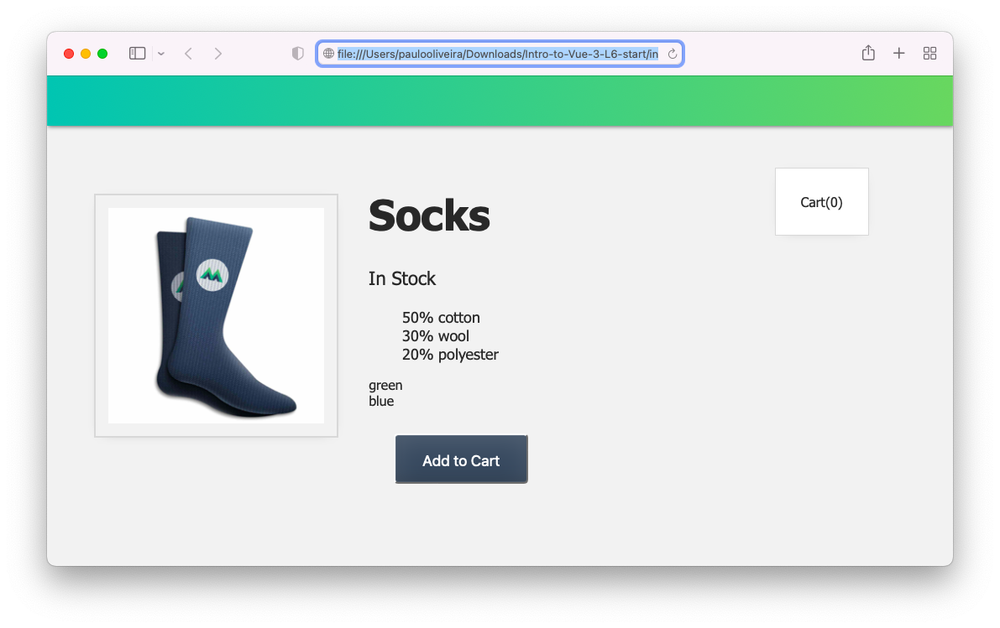
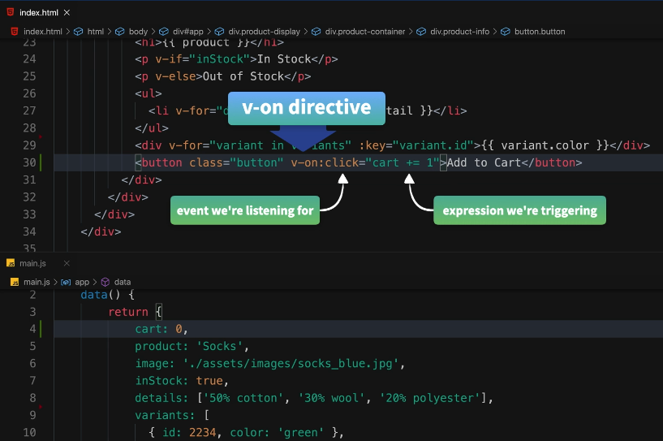
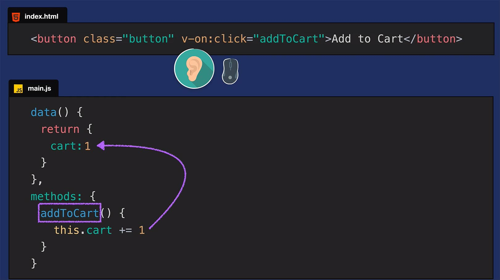
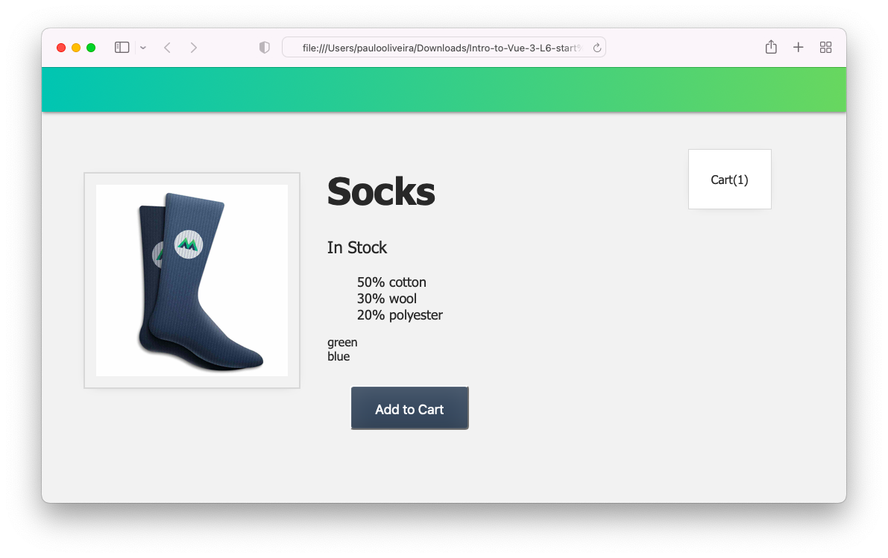
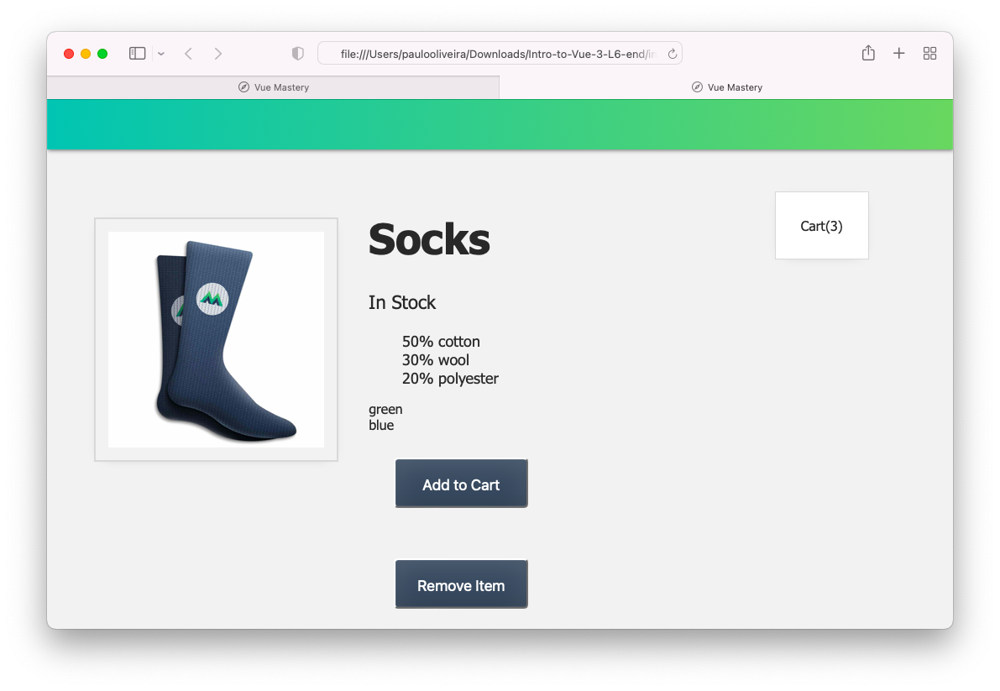

# **Introdução ao Vue.JS 3**

## **Este repositório possui um curso rápido de introdução ao Vue.JS 3**

Neste curso vamos aprender os fundamentos do Vue.JS e construir uma aplicação (_app_) para colocar estes conceitos em prática. Veja a figura abaixo.


## **IDE recomendado**

Vai-se utilizar o VSCode. Caso você ainda não o tenha [baixe-o](https://code.visualstudio.com/download), e depois instale-o.

Instale, também uma extensão do VSCode chamada [es6-string.html](https://marketplace.visualstudio.com/items?itemName=Tobermory.es6-string-html)

No final de cada tutorial, haverá um "Coding Challenge" para colocar os conceitos em prática.

## **Tutorial 6. Tratamento de Eventos**

### **Passo 1. Configurando o ambiente de desenvolvimento**

1.1 Crie uma pasta chamada "intro-to-vue-3"

>Ignore o passo acima caso já tenha feito o **Tutorial 2** (Criando um Vue _app_ ).

1.2 Caso queira, para iniciar, faça o download do código inicial no "branch" do [repositório.](https://github.com/csp1po/intro_vue_3/tree/t6-start). Depois extraia este arquivo e copie o seu conteúdo para dentro da pasta criada no passo 1.1.

1.3 No painel esquerdo do VS Code, você verá uma estrutura de diretório que se parece com a figura abaixo.


Dentro do arquivo "**index.html**", o seu conteúdo será:

```html
<!DOCTYPE html>
<html lang="en">
  <head>
    <meta charset="UTF-8" />
    <title>Vue Mastery</title>
    <!-- Import Styles -->
    <link rel="stylesheet" href="./assets/styles.css" />
    <!-- Import Vue.js -->
    <script src="https://unpkg.com/vue@3/dist/vue.global.js"></script>
  </head>
  <body>
    <div id="app">
      <div class="nav-bar"></div>

      <div class="cart">Cart({{ cart }})</div>
      
      <div class="product-display">
        <div class="product-container">
          <div class="product-image">
            
          </div>
          <div class="product-info">
            <h1>{{ product }}</h1>
            <p v-if="inStock">In Stock</p>
            <p v-else>Out of Stock</p>
            <ul>
              <li v-for="detail in details">{{ detail }}</li>
            </ul>
            <div v-for="variant in variants" :key="variant.id">{{ variant.color }}</div>
            <button class="button">Add to Cart</button>
          </div>
        </div>
      </div>
    </div>

    <!-- Import App -->
    <script src="./main.js"></script>

    <!-- Mount App -->
    <script>
      const mountedApp = app.mount('#app')
    </script>
  </body>
</html>
```

> Observe que neste tutorial estaremos importando a biblioteca do Vue.JS via um link CDN (_content delivery network_). Este tipo de importação se usa somente para fins de prototipagem e aprendizado. Futuramente usaremos a instalação via uma interface de linha de comando (Vue CLI).
>
>Observe também que estamos importando um arquivo chamado "**main.js**". O seu conteúdo, por enquanto, é:

```javascript
const app = Vue.createApp({
    data() {
        return {
            cart:0,
            product: 'Socks',
            image: './assets/images/socks_blue.jpg',
            inStock: true,
            details: ['50% cotton', '30% wool', '20% polyester'],
            variants: [
              { id: 2234, color: 'green', image: './assets/images/socks_green.jpg' },
              { id: 2235, color: 'blue', image: './assets/images/socks_blue.jpg' },
            ]
        }
    }
})
```

>Neste tutorial, veremos o conceito de tratamento ou manipulação de eventos (_Event Handling_).
>Ao abrir o arquivo "**index.html**" no browser, você verá que agora temos um botão ``Add to Cart`` (Adicionar ao carrinho), junto com uma ``<div>``com a classe ``cart``, que inclui uma expressão para imprimir o valor de nossos novos dados do carrinho. Ver figura abaixo.



>No arquivo "**index.html**" o código que estamos falando acima é este:

```html
<div class="cart">Cart({{ cart }})</div>
...
<button class="button">Add to Cart</button>
```

>Já no arquivo "**main.js**" teremos o conteúdo abaixo:

```javascript
const app = Vue.createApp({
    data() {
        return {
            cart: 0,
            product: 'Socks',
            image: './assets/images/socks_blue.jpg',
            inStock: true,
            details: ['50% cotton', '30% wool', '20% polyester'],
            variants: [
              { id: 2234, color: 'green', image: './assets/images/socks_green.jpg' },
              { id: 2235, color: 'blue', image: './assets/images/socks_blue.jpg' },
            ]
        }
    }
})
```

>Inserimos uma propriedade chamada ``cart`` e a inicializamos com ``0``.

>Em suma, o que queremos é cada vez que clicarmos no botão ``Add to Cart`` o valor de ``cart`` é incrementado.

### **Passo 2. Ouvindo (Escutando) Eventos**

A grande pergunta aqui é: **como nós ouvimos eventos em elementos HTML**? 

Existe uma diretiva no Vue.JS que serve para isto. Ela se chama ``v-on``. A figura abaixo ilustra como funciona.



>Coloca-se ``v-on``seguido por dois pontos ``:`` e especificamos o tipo de evento que queremos "**ouvir**". Neste caso será ``click``. Depois, entre aspas, a expressão que estamos acionando. Aqui, estamos incrementando ``cart`` por 1.

2.1 Abra o arquivo "**index.html**" e procure o pelo trecho de código abaixo:

```html
<button class="button">Add to Cart</button>
```

Altere o código acima para:

```html
<button class="button" v-on:click="cart += 1">Add to Cart</button>
```

>Como a lógica acima ``cart += 1`` é muito simples, podemos mantê-lo alinhado no elemento de botão, como mostra a figura acima. Mas, muitas vezes, precisamos acionar uma lógica mais complexa. Nessas situações, podemos adicionar um método para disparar quando o evento acontecer. É o que vamos fazer agora.


2.2 Abra o arquivo "**index.html**" e procure o pelo trecho de código abaixo:

```html
<button class="button" v-on:click="cart += 1">Add to Cart</button>
```
Agora altere o código para:

```html
<button class="button" v-on:click="addToCart">Add to Cart</button>
```
>Agora, quando o botão for clicado, o método ``addToCart`` será executado.


2.3 Vamos adicionar esse método (``addToCart``) ao objeto de opções do nosso _app_ Vue. Para isto, abra o arquivo "**main.js**", e adicione o trecho de código abaixo:

```javascript
const app = Vue.createApp({
  data() {
    return {
      cart: 0,
      ...
    }
  },
  methods: {
    addToCart() {
      this.cart += 1
    }
  }
})
```

>Observe que adicionamos a opção ``methods`` e, dentro dela, adicionamos o novo método ``addToCart``, que contém a mesma lógica que tínhamos anteriormente em linha (**Passo 2.1**). A diferença aqui é que agora estamos usando ``this.cart`` para se referir à propriedade ``cart`` que faz parte dos dados desta instância do Vue.


2.3 Agora abra o arquivo "**index.html**" no browser. Agora devemos ser capazes de clicar no botão "**Add To Cart**" e ver o valor de ``cart`` que se encontra no lado direito superior da página, subir em 1. Ver a figura abaixo.


### **Passo 3. Compreendendo a Diretiva ``v-on``**

Vamos dar uma olhada mais profunda em como esse tratamento de eventos está funcionando. Observe a figura abaixo.



Ao adicionar a diretiva ``v-on`` a um elemento, estamos essencialmente dando a ele um ouvido para ouvir eventos. Nesse caso, especificamos que estamos ouvindo eventos de clique. Quando ele acontece, o método ``addToCart`` é executado, que como acabamos de ver, pega o valor de ``cart`` e o incrementa em uma unidade.


#### Abreviando ``v-on``
>Assim como ``v-bind`` tinha uma abreviação ``:``, ``v-on`` também tem uma: que é ``@``

Isto quer dizer que nosso código poderia ser simplificado assim. 

```html
<button class="button" @click="addToCart">Add to Cart</button>
```


### **Passo 4. Eventos de ``mouseover``**

No momento, estamos exibindo as cores variantes, “green” e “blue”, logo abaixo dos detalhes do produto. Ver figura abaixo.


Não seria legal se, ao passarmos o mouse sobre as palavras “green” e “blue”, ativássemos uma atualização da imagem para a meia verde ou azul, respectivamente? Para isto, vamos adicionar a capacidade de ouvir eventos de ``mouseover`` (termo do Vue para “**hover**”) nesses nomes de cores.

4.1 Vamos adicionar uma nova propriedade a cada objeto ``variant``. Abra o arquivo "**main.js**", e altere a linha da propriedade para:

```javascript
data() {
  return {
    ...
    variants: [
      { id: 2234, color: 'green', image: './assets/images/socks_green.jpg' },
      { id: 2235, color: 'blue', image: './assets/images/socks_blue.jpg' },
    ]
  }
}
```

>Agora, cada variante tem um caminho de imagem para as meias verde e azul, respectivamente. Estamos prontos para adicionar um ``listener`` para eventos de ``mouseover`` na ``div`` da variante de cores.

4.2 Abra o arquivo "**index.html**" e altere a linha de código onde está a ``<div>`` para:

```html
<div v-for="variant in variants" :key="variant.id" @mouseover="updateImage(variant.image)">{{ variant.color }}</div>
```

Observe que quando um evento de ``mouseover`` acontece, estamos acionando o método ``updateImage``, e passando o caminho da imagem de cada variante. 


4.3 Agora abra o arquivo "**main.js**" a adicone o método abaixo:

```javascript
methods: {
  ...
  updateImage(variantImage) {
    this.image = variantImage
  }
}
```

>O método espera ``variantImage`` como parâmetro e, quando é executado, define ``this.image`` (nos dados dessa instância do Vue) igual à imagem variante que foi passada.

>Agora no navegador, quando passarmos o mouse sobre ``green``, devemos ver a imagem das meias verdes. Quando passamos o mouse sobre ``blue``, devemos ver a imagem das azuis.

4.4 Abra o arquivo "**index.html**" no browser. Você verá algo assim.


Ou assim:




### **Passo 5. Coding Challenge**

5.1 Crie um novo botão que decrementa o valor de ``cart``.


5.2 Abra o arquivo "**index.html**" no browser. Você verá algo assim.




